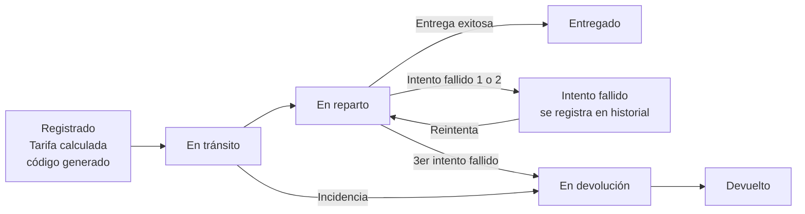

# Diagrama de flujo del proceso — Envíos Rápidos GT

Diagrama de secuencia de estados de un envío, según las reglas del examen
(Regla 2 y 3): máximo 3 intentos de entrega, transiciones solo en una dirección.

## Reglas aplicadas

- **Regla 1:** la tarifa se calcula automáticamente al registrar (estado `Registrado`).
- **Regla 2:** máximo 3 intentos de entrega; al fallar el tercero, el envío pasa
  automáticamente a `EnDevolucion`.
- **Regla 3:** las transiciones solo avanzan en una dirección:
  `Registrado -> EnTransito -> EnReparto -> Entregado`
  con ramas hacia `EnDevolucion -> Devuelto`.
- **Regla 4 y 6:** cada cambio de estado registra oficina, timestamp y notas
  opcionales en la tabla `Historial`.
- **Regla 5:** el código de rastreo se genera con formato `ENV-YYYYMMDD-XXXX`.
- **Regla 7:** si remitente o destinatario tiene NIT válido, se aplica 5% de
  descuento sobre la tarifa calculada.
